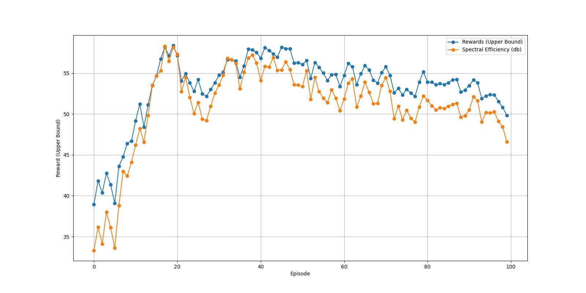
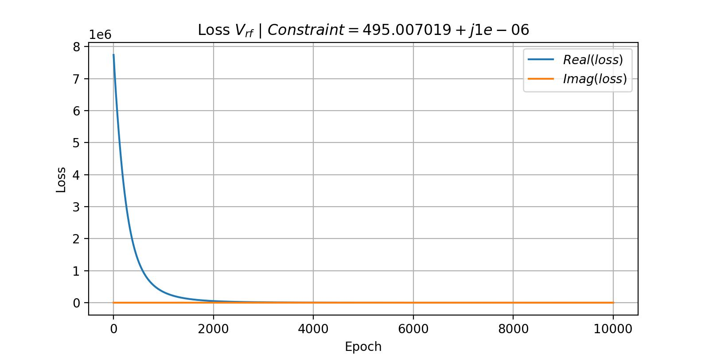

# PrecoderNet


This repository contains the implementation of the "PrecoderNet: Hybrid Beamforming for Millimeter Wave Systems with Deep Reinforcement Learning" paper with DDPG model.

**Note:** based on the paper for calculating `v_rf` based on `v_bb` and the given constraint, the authors suggested using Manifold Optimization (MO) Algorithm to satisfy the given constraint based on the base station's power. But I optimized it with the help of the Adam Algorithm. You can check out `PrecoderNet/environment/v_rf_optim.py`.

## Installation

```bash
git clone git@github.com:mhyrzt/PrecoderNet.git
cd PrecoderNet
pip install -e .
```

## Example

```python
# Import Modules
import numpy as np
from PrecoderNet import Trainer
from PrecoderNet.ddpg import DDPG
from PrecoderNet.models import Actor, Critic
from PrecoderNet.environemt import Environment, plot_loss
from PrecoderNet.random_process import OrnsteinUhlenbeckProcess

# Config File
n_s = 6
n_r = 32

# Change This However You like :)) Based on Base Station Channel Matrix
channel_matrix = np.random.randn(n_r, n_s)

ENV_CONFIG = {
    "P": 120,
    "var": 1,
    "beta": 0.1,
    "n_t": 128,
    "n_r": n_r,
    "n_s": n_s,
    "n_t_rf": 6,
    "n_r_rf": 6,
    "n_cl": 8,
    "n_ray": 10,
    "v_rf_a": 100,
    "v_rf_iteration": 10_000,
    "channel_matrix": channel_matrix
}

EPOCHS = 64
MEM_MAX_LEN = 1024
MEM_BATCH_SIZE = 16
RESULT_FOLDER = "./results/results.jpg"

# Training
env = Environment(**ENV_CONFIG)
plot_loss(env)
k = env.get_layer_size()
random_process = OrnsteinUhlenbeckProcess(
    size=k,
    theta=0.15,
    mu=0.0,
    sigma=0.2
)
ddpg = DDPG(
    Actor(k, k, (512, 512, 512)),
    Critic(k, k, (512, 512, 512)),
    MEM_MAX_LEN,
    MEM_BATCH_SIZE,
    random_process
)
Trainer(env, ddpg, EPOCHS) \
    .train() \
    .save_progress_plot(RESULT_FOLDER)

```

## Results

results for following example:

### Progress Plot



### `v_rf` Plot



## Article

```
@ARTICLE{9112250,
  author={Wang, Qisheng and Feng, Keming and Li, Xiao and Jin, Shi},
  journal={IEEE Wireless Communications Letters},
  title={PrecoderNet: Hybrid Beamforming for Millimeter Wave Systems With Deep Reinforcement Learning},
  year={2020},
  volume={9},
  number={10},
  pages={1677-1681},
  doi={10.1109/LWC.2020.3001121}}
```
